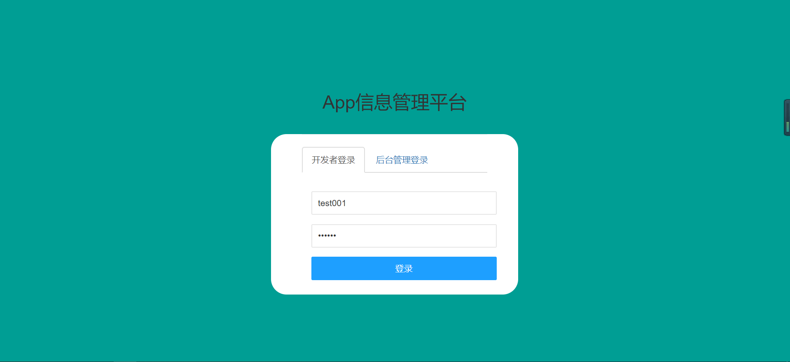
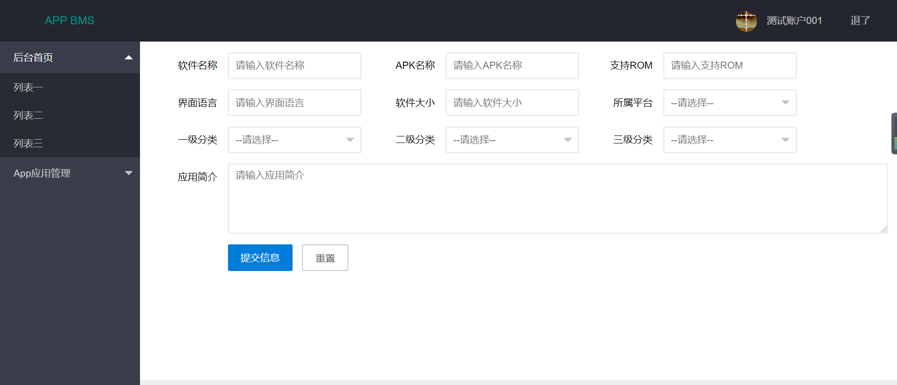

# app_management_system
App信息管理系统

### 一、开发工具

- #### InteliJ IDEA 2019

- #### Maven 3.6.1

### 二、.功能介绍

- #### 1. 增删改查

- #### 2. 分页查询

- #### 3. ajax

### 三、技术支持

- #### 1. 基础框架（SSM-Spring+SpringMVC+Mybatis）

  - ##### Spring 5.1.6

  - ##### Mybatis 3.5.1

- #### 2. 数据库-Mysql 8.0

- #### 3. 前端框架-Layui 

- #### 4. 项目依赖管理-Maven 3.6.1

- #### 5. 分页插件 PageHelper

- #### 6. 逆向工程-mybatis-generator

### 四、项目截图

